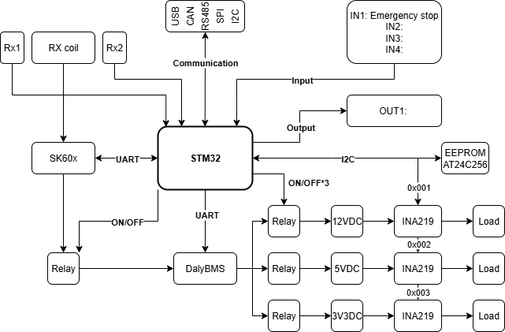

# 🔋 STM32 Power Management System

## 📌 Project Overview
This is a smart power management module using STM32 as the central controller, capable of monitoring and controlling power outputs (12V, 5V, 3.3V), and communicating with:
- Daly BMS module
- SK60x solar charger
- INA219 current/voltage sensors
- AT24C256 EEPROM for logging
- Radxa SBC via Modbus RTU

---
## ⚙️ Hardware Components

| Component      | Description                          |
|----------------|--------------------------------------|
| STM32F103C8T6  | Main MCU running FreeRTOS           |
| DalyBMS        | Manages Li-ion battery pack           |
| SK60x          | Solar charging module                 |
| INA219 x3      | Monitors voltage/current at outputs   |
| AT24C256       | EEPROM for historical data logging    |
| Radxa          | Reads data via RS485/Modbus           |
| Relay x3       | Controls 12V, 5V, and 3.3V outputs     |

---

## 📐 System Architecture

---
## 🧰 Main Features

- ✅ Read voltage, current, SoC from DalyBMS
- ✅ Read charging voltage from SK60x
- ✅ Log data to AT24C256 EEPROM
- ✅ Monitor output power lines with INA219
- ✅ Control relays for 12V/5V/3.3V outputs
- ✅ Provide Modbus RTU interface for Radxa SBC

---
## 🔌 Modbus RTU Interface

- **Slave ID:** `0x01`
- **Baudrate:** `9600bps`, `8N1`
- **Function Codes:** `0x03`, `0x06`, `0x10`
- See register mapping in [`Docs/modbus_register_map.md`](./Docs/modbus_register_map.md)

---